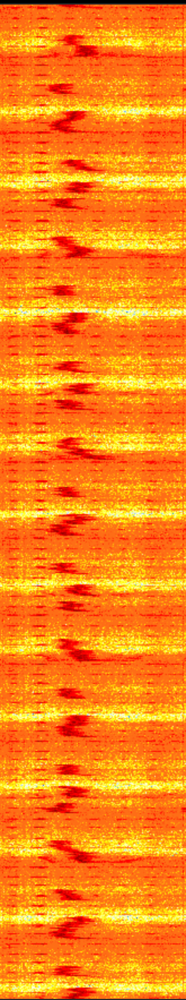
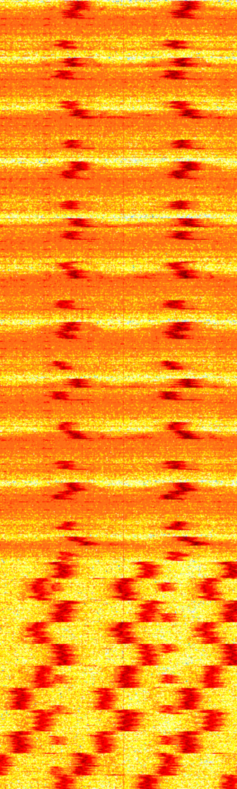

# Interference caused by ZUJO wireless charger [501972]

Since wireless phone chargers produce electromagnetic fields to transfer energy, they can cause interference with radio communication systems.

## Device images

## Interference

The interference caused by the ZUJO wireless charger was tested on a RTL-SDR Dipole antenna connected to a RTL-SDR V3 dongle. The charger was placed a few millimetres away from the antenna.

### Frequencies

Interference was observed on the following frequencies:
- No observed interference below **15MHz**
- High interference above **15MHz**
- Maximum interference at **30MHz**
- Interference decreases the higher the frequency.

No observation was done above **500MHz**.

### Distance

The interference was picked up as far as **1.5 meters** away from the charger.

## Waterfall

The following waterfall shows the interference caused by the ZUJO wireless charger on the RTL-SDR.

### Whilst phone is not charging

### Whilst phone is charging

### When the phone is taken off the charger

## Recording

<audio controls src="recordings/Charging.wav" title="Charging"></audio>
<audio controls src="recordings/Not on charge.wav" title="Not on charge"></audio>
<audio controls src="recordings/Taken off charge.wav" title="Taken off charge"></audio>